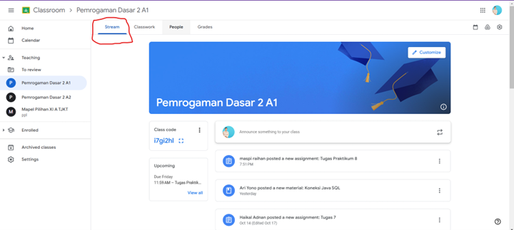
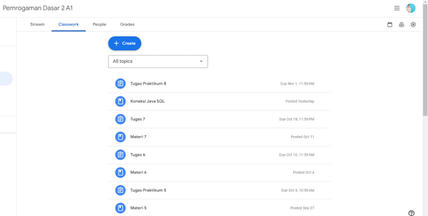
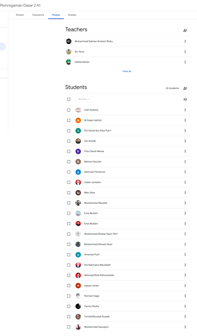
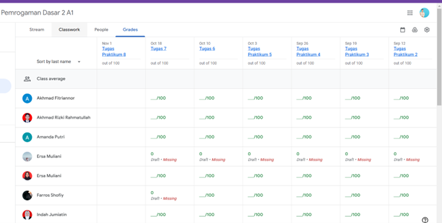
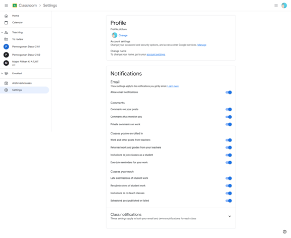
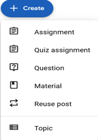

# Penjelasan Fitur-Fitur Google Classroom

**Google Classroom** adalah platform pembelajaran daring yang disediakan oleh Google untuk membantu pengajar dan siswa mengelola tugas, berkomunikasi, serta berbagi materi pembelajaran. Berikut adalah penjelasan fitur-fitur yang ada di Google Classroom beserta fungsinya dan cara penggunaannya:

## 1. Stream
- **Fungsi**: Sebagai ruang utama untuk pengumuman, diskusi, dan pembaruan dari guru kepada siswa.
- **Cara Menggunakan**: Guru dapat menambahkan pengumuman, memberi komentar, atau menjawab pertanyaan siswa melalui tab ini. Siswa juga bisa menanggapi pengumuman atau bertanya mengenai materi yang disampaikan di kelas.
  

## 2. Classwork
- **Fungsi**: Untuk mengelola tugas, kuis, dan materi pelajaran secara terstruktur.
- **Cara Menggunakan**: Guru dapat membuat tugas baru, mengunggah materi, atau memberikan kuis melalui tab Classwork. Siswa dapat mengakses tugas dan materi, mengerjakan serta menyerahkan hasil tugas di sini.

## 3. People
- **Fungsi**: Untuk melihat daftar siswa dan guru di dalam kelas tersebut.
- **Cara Menggunakan**: Guru dapat menambahkan atau mengundang siswa dan guru lain sebagai kolaborator. Siswa bisa melihat rekan sekelas dan siapa saja yang menjadi pengajar di kelas tersebut.
  

## 4. Grades
- **Fungsi**: Untuk memantau nilai tugas dan pekerjaan siswa.
- **Cara Menggunakan**: Guru dapat menilai tugas yang telah dikumpulkan oleh siswa dan memberikan feedback secara langsung. Siswa juga bisa melihat nilai tugas mereka.
  

## 5. Settings
- **Fungsi**: Mengatur preferensi kelas, seperti nama kelas, deskripsi, kode kelas, dan pengaturan notifikasi.
- **Cara Menggunakan**: Guru bisa mengakses pengaturan untuk menyesuaikan preferensi kelas atau mengubah pengaturan notifikasi.
  

## 6. Assignment dan Quizzes
- **Fungsi**: Untuk membuat tugas dan kuis yang terstruktur dan mudah dikelola.
- **Cara Menggunakan**: Guru dapat menambahkan tugas atau kuis, mengatur tenggat waktu, serta memberikan panduan tugas. Siswa bisa mengakses tugas yang diberikan, mengerjakannya, dan menyerahkannya sebelum tenggat waktu.
  

## 7. Feedback dan Private Comment
- **Fungsi**: Memberikan komentar dan masukan terkait tugas secara personal.
- **Cara Menggunakan**: Guru dapat memberikan komentar langsung pada tugas siswa sebagai bentuk feedback. Siswa juga dapat bertanya atau memberikan respon kepada guru secara pribadi mengenai tugas yang diberikan.
