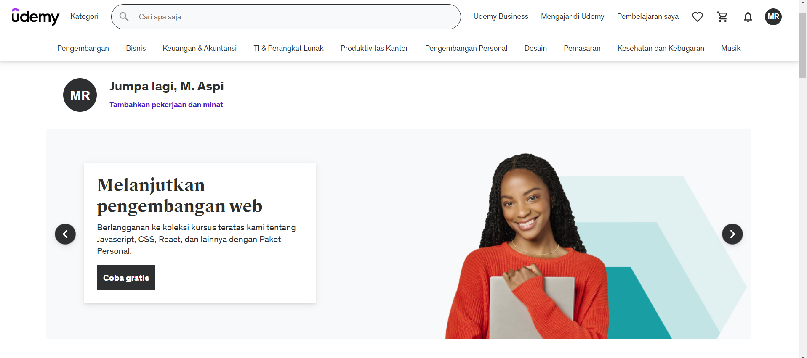
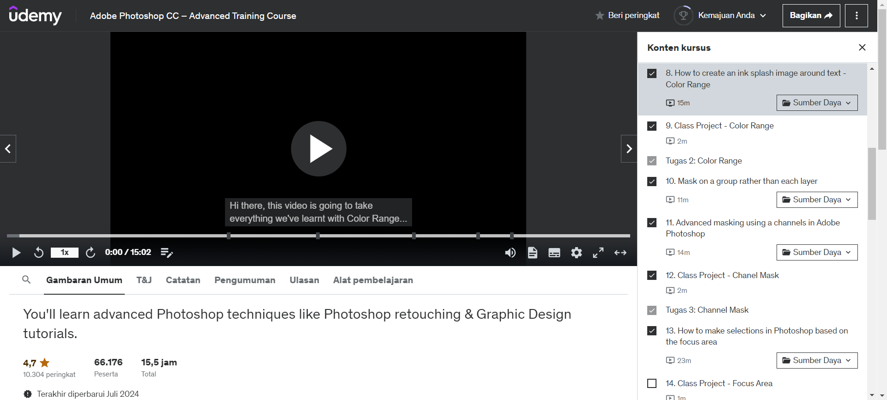
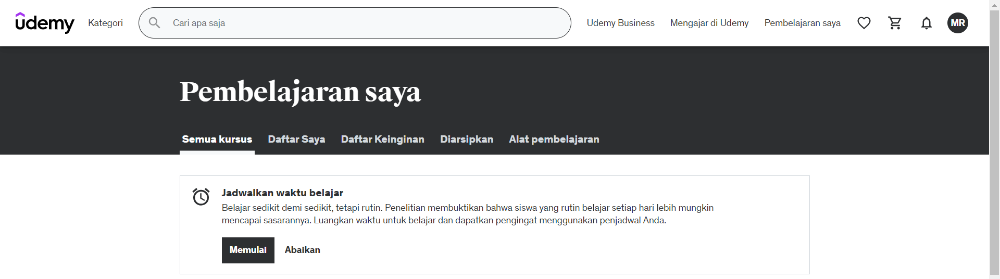
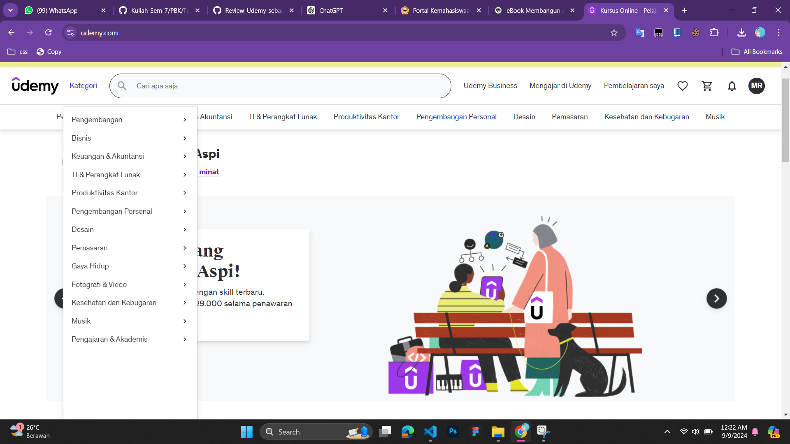
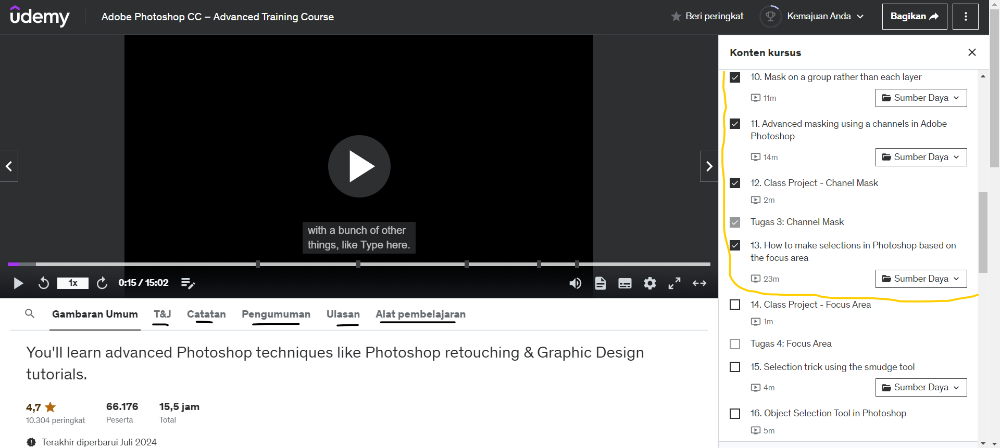

##### Dibuat Oleh : M. Aspi Raihan

## Udemy

**Udemy** adalah salah satu platform pembelajaran daring terbesar yang menawarkan beragam kursus dalam berbagai bidang, termasuk teknologi, bisnis, pengembangan pribadi, dan banyak lagi. Dengan pendekatan yang fleksibel, Udemy memberikan kesempatan bagi peserta didik untuk belajar kapan saja dan di mana saja. Udemy dapat diakses melalui laman [https://www.udemy.com](https://www.udemy.com).

**Udemy** bertujuan untuk menyediakan akses pembelajaran berkualitas kepada semua orang di seluruh dunia, memberdayakan pengajar dan pelajar dengan alat untuk mengembangkan keterampilan baru yang relevan dengan dunia kerja modern.

Saat ini, Udemy telah digunakan oleh lebih dari **40 juta** pelajar dari berbagai negara di seluruh dunia.

Udemy didirikan pada tahun 2010 dengan visi untuk menyediakan pendidikan yang lebih terjangkau dan fleksibel bagi semua orang.

Dengan berbagai kursus yang tersedia, peserta didik dapat memilih dan mempelajari topik-topik yang relevan dengan kebutuhan dan minat mereka. Udemy memungkinkan peserta untuk belajar secara mandiri dan interaktif melalui video, kuis, serta sumber daya tambahan yang disediakan oleh pengajar.

Contoh berikut menunjukkan kursus Photoshop pada platform Udemy, di mana siswa dapat menonton video dan mempraktikkan konsep langsung.

Udemy menyediakan kursus-kursus dengan berbagai tema dan topik yang relevan, baik untuk pemula maupun yang sudah berpengalaman.

## Penghargaan yang diraih Udemy
- **G2 Crowd**: Best Online Learning Platform (2021)
- **Techradar**: Best Value for Money in Online Education (2022)
- **Trustpilot**: Most Reliable E-Learning Platform (2023)
- **EdTech Awards**: Best in Class Digital Learning (2024)

## Ulasan Pengguna
Dari ratusan ribu ulasan di platform, Udemy mendapatkan rating rata-rata **4.6 / 5** dari pengguna di seluruh dunia.

Menurut laman **Trustpilot**, Udemy menerima rating **4.5 / 5** berdasarkan 30.000 ulasan. Kursus di Udemy sering kali dinilai sangat baik dalam hal konten yang relevan dan pengajaran yang mudah diikuti.

## Kelebihan 
- **Akses Global:** Udemy menawarkan kursus dalam berbagai bahasa dan tersedia bagi pengguna dari seluruh dunia, memberikan fleksibilitas penuh dalam hal waktu dan tempat belajar.

- **Materi Pembelajaran yang Luas:** Terdapat lebih dari 150.000 kursus yang tersedia di berbagai bidang, mencakup topik mulai dari pengembangan perangkat lunak hingga kesehatan dan kebugaran.

- **Fleksibilitas Pembelajaran:** Peserta dapat belajar dengan kecepatan mereka sendiri, memulai, menjeda, dan melanjutkan kursus kapan saja sesuai kebutuhan.

## Kekurangan
- **Kualitas Kursus Bervariasi:** Tidak semua kursus di Udemy memiliki kualitas yang sama. Ada beberapa kursus yang disusun dengan baik, namun ada juga yang kurang mendalam atau tidak terstruktur dengan baik.

- **Berbayar:** Sebagian besar kursus berkualitas memerlukan biaya untuk diakses. Harga kursus dapat bervariasi, dan walaupun sering ada diskon, biaya tetap menjadi salah satu penghalang bagi beberapa pengguna.

##  Udemy sebagai Tutor, Tool, dan Tutee
**Udemy** berperan sebagai *Tutor* dengan menyediakan instruksi, bimbingan, dan struktur kursus yang terarah. Pengajar dapat membuat kursus sesuai dengan kebutuhan peserta, memberikan materi pelajaran dalam bentuk video, kuis, serta tugas-tugas yang mendorong pembelajaran aktif. 

Sebagai *Tools*, Udemy menyediakan platform yang memungkinkan peserta untuk mengakses berbagai sumber daya pembelajaran, seperti video pembelajaran, materi bacaan, serta forum diskusi. Peserta dapat belajar kapan saja dan di mana saja menggunakan perangkat apapun, baik desktop maupun mobile.

Sebagai *Tutee*, Udemy menawarkan fleksibilitas bagi pelajar dalam memilih materi yang sesuai dengan kebutuhan mereka. Peserta dapat mengatur waktu belajar mereka sendiri dan mengakses kursus kapan saja. Platform ini juga menyediakan sertifikat setelah menyelesaikan kursus, yang dapat digunakan untuk meningkatkan portofolio atau melamar pekerjaan.

## Kesimpulan
**Udemy** adalah kombinasi dari *Tutor* dan *Tools* yang menawarkan akses mudah ke pembelajaran dengan harga yang terjangkau. Platform ini memberikan fleksibilitas penuh kepada peserta untuk belajar sesuai kecepatan dan kebutuhan mereka. Meski kualitas kursus bervariasi, Udemy tetap menjadi salah satu platform pembelajaran daring terbaik yang membantu banyak orang dalam meningkatkan keterampilan mereka secara mandiri.